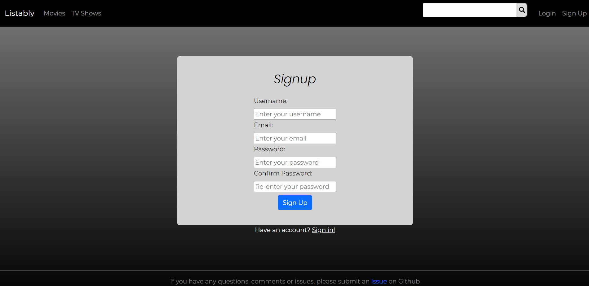
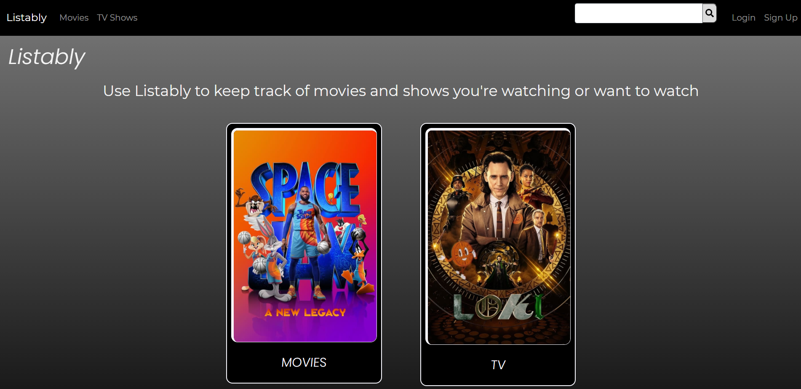
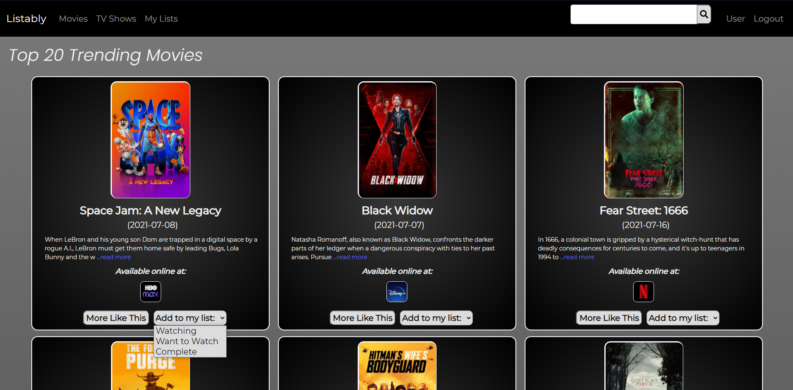
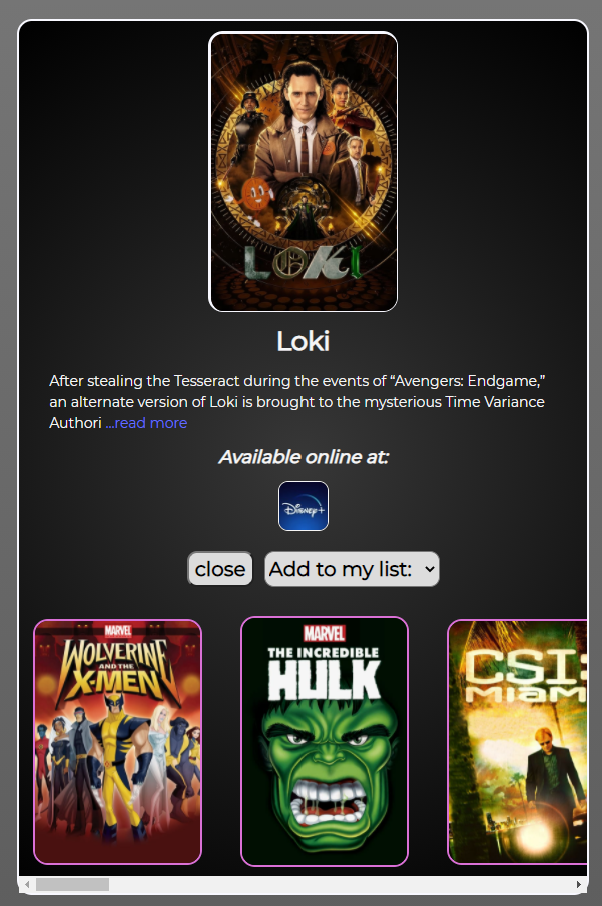
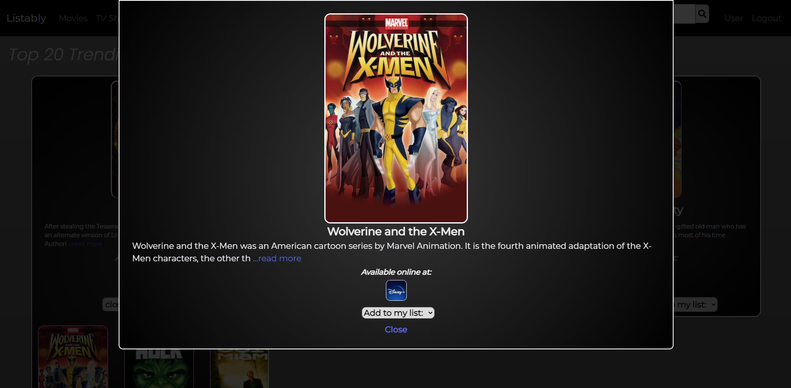
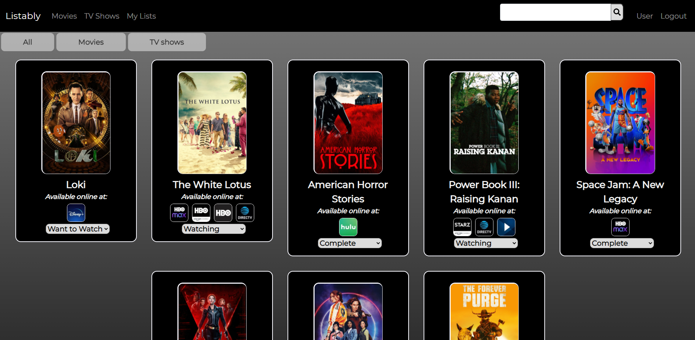

# ListablyReact

## Description
In a world where streaming platforms are the new method of media consumption, we think that there are too many providers which can make the media search process difficult. Listably is a media consumption tracker where a user can find movies and TV shows and where they can watch it online. Our website helps users keep a consolidated list of the media they would like to track on a simple dashboard.

## Table of Contents
- [Description](#description)
- [Usage](#usage)
- [Contributing](#contributing)
- [Questions](#questions)

## Usage
1. Go to [Listably](listably.herokuapp.com)
	
2. Please create an account or sign in on the top right corner of the page.
	

3. Navigate to the trending page by clicking Movies/TV Shows on the nav bar or the circular image from the home page or use the search bar to conduct a search. 
	

4. Add media that you would like to keep track on by using the dropdown on each card.  
    

5. Check out similar movies by clicking on "More Like This"  
    

6. Click on media poster under "More Like This" to view more details  

7. Click on "My List" to see the media that you have saved to your list. Use the column on the left to filter your results.
    

## Contribution
#### Contributors
[Joseph Cordell](https://github.com/JosephCordell), 
[Paul Jeffery](https://github.com/Paulndrwjeffrey), 
[Melissa Tan](https://github.com/melissa-tan), 
[Kila Weeks](https://github.com/kilaweeks)

## Questions
If you have any questions or see any issues, please submit and [issue](https://github.com/JosephCordell/Listably/issues) on GitHub!

